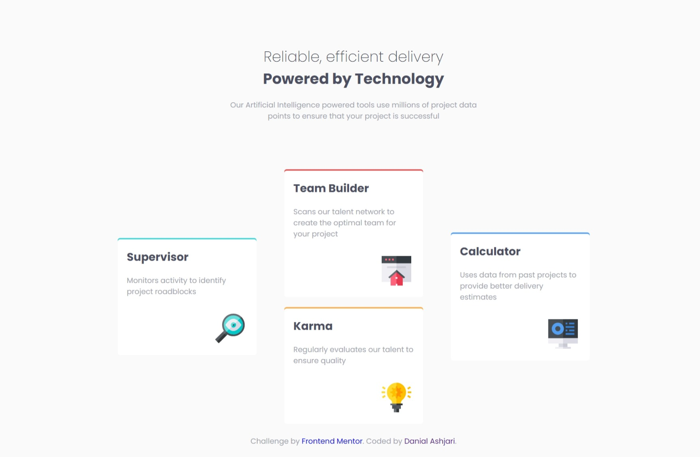
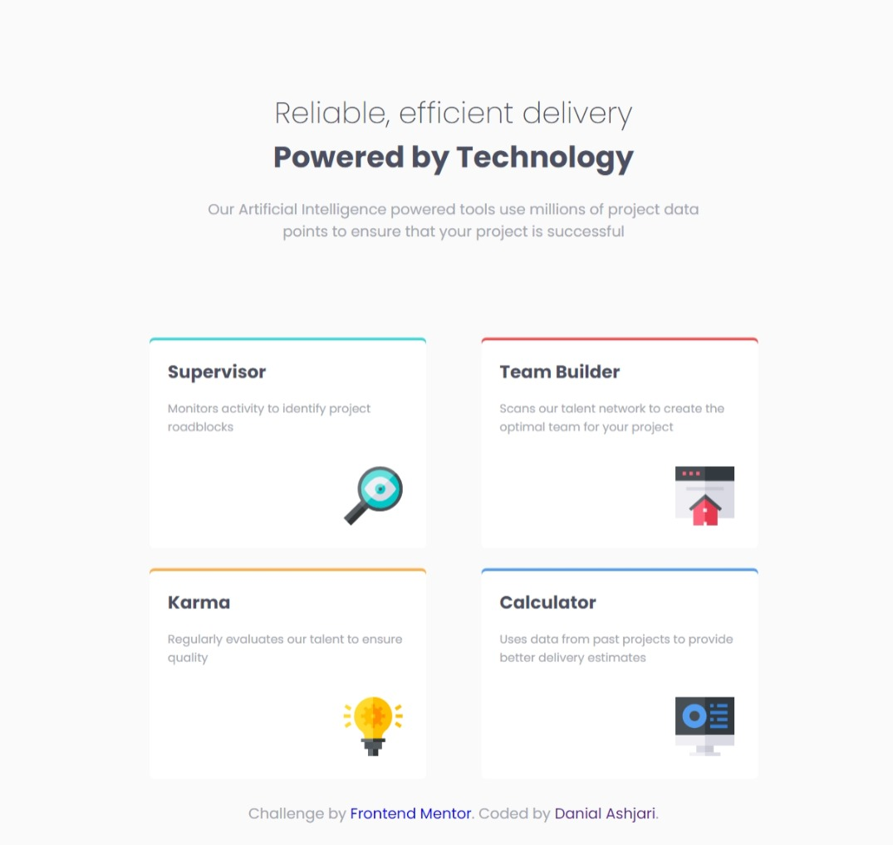
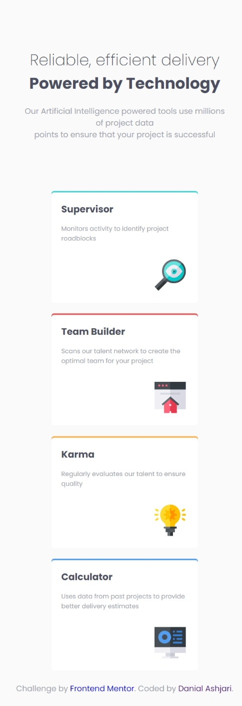

# Frontend Mentor - Four card feature section solution

This is a solution to the [Four card feature section challenge on Frontend Mentor](https://www.frontendmentor.io/challenges/four-card-feature-section-weK1eFYK). Frontend Mentor challenges help you improve your coding skills by building realistic projects.

## Table of contents

- [Overview](#overview)
  - [The challenge](#the-challenge)
  - [Screenshot](#screenshot)
  - [Links](#links)
- [My process](#my-process)
  - [Built with](#built-with)
  - [What I learned](#what-i-learned)
  - [Continued development](#continued-development)
  - [Useful resources](#useful-resources)
- [Author](#author)

## Overview

### The challenge

Users should be able to:

- View the optimal layout for the site depending on their device's screen size
- build flexible layouts using grid and flexbox.

### Screenshot





### Links

- Live Site URL: [live site URL here](https://danielashjari.github.io/four-card-feature-section-master/)

## My process

### Built with

- HTML5
- SCSS
- Flexbox
- CSS Grid

### What I learned

I learned how to use grid, I also used a style property which was new for me as a newbie.

```css
    .supervisor {
      box-shadow: 0 -3px 0 0 var(--superviser);
    }
```

```SCSS
  .supervisor {
    box-shadow: 0 -3px 0 0 var(--superviser);
    @include breakpoint(large) {
      grid-column: 1/2;
      grid-row: 1/3;
      align-self: center;
    }
  }
```

### Continued development

I want to continue the learning path provided by frontend mentor, designing more complex pages.

### Useful resources

- [CSS Grid](https://cssgrid.io/) - This free course by Wes Bos, in partnership with Mozilla Firefox, teaches you all about CSS Grid.
- [This challenge by Tonmoy Sarker](https://www.frontendmentor.io/solutions/responsive-feature-section-grid--bgvKPvMyy) - This solution gave me a great understanding of the concepts.

## Author

- Github - [Daniel Ashjari](https://github.com/danielashjari)
- Frontend Mentor - [@danielashjari](https://www.frontendmentor.io/profile/danielashjari)
